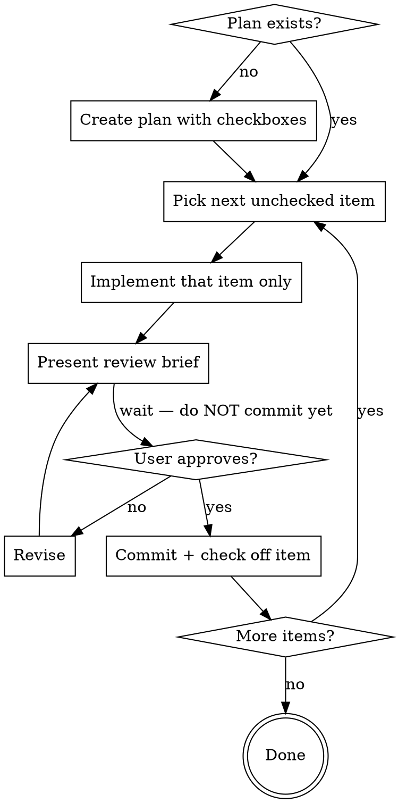

# Reviewable Batches

## Overview

Never implement more than one plan item before stopping for review.  
Never commit before the user explicitly approves.

## Workflow



## Phase 1 — Plan

Create (or open) a plan file with one checkbox per deliverable:

```markdown
## Implementation Plan

- [ ] Step 1: description
- [ ] Step 2: description
- [ ] Step 3: description
```

Keep items small enough to implement and explain in a single turn.  
Store the plan somewhere visible (e.g. the project README, a `PLAN.md`, or a `.claude/plans/` file).

## Phase 2 — Implement One Item

Pick the **first unchecked** item. Implement **only that item** — no look-ahead, no "while I'm here" changes.

## Phase 3 — Review Brief (BEFORE committing)

Present this before every commit, every time:

```
## Ready to commit: [item description]

**What changed:** [list files and what was added/modified]
**How it works:** [1–3 sentences on the approach]
**Notable decisions:** [anything non-obvious or worth flagging]

Approve to commit, or tell me what to revise.
```

Then **stop**. Do not commit. Do not proceed to the next item. Wait for explicit approval.

## Phase 4 — Commit on Approval

When the user approves:
1. Commit with a message that describes the item
2. Mark the checkbox: `- [x] Step N`
3. Move to the next unchecked item

## Red Flags — Stop Immediately

- "I'll implement the next step while I'm at it" → **stop, one item only**
- "I'll commit and then show the summary" → **brief first, always**
- User said "looks good" to a previous item → **still brief the next one**
- No plan file exists → **create one before writing any code**

## Common Mistakes

| Mistake | Fix |
|---|---|
| Implementing 2+ items before briefing | Revert extra changes, brief what's done, wait for approval |
| Committing before approval | Don't. The brief comes first, always |
| Vague brief ("updated the notebook") | Name specific files and explain the approach |
| Skipping brief on "trivial" changes | Every commit gets a brief, no exceptions |
